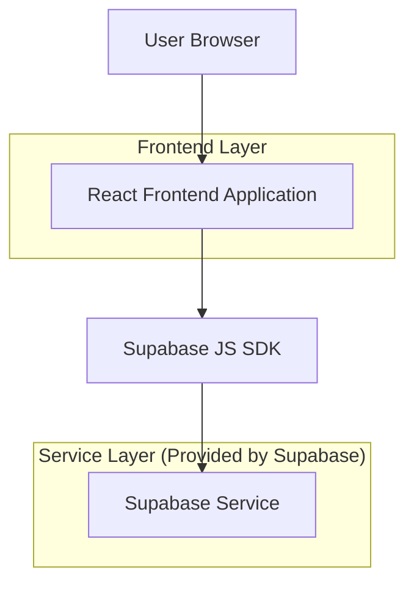
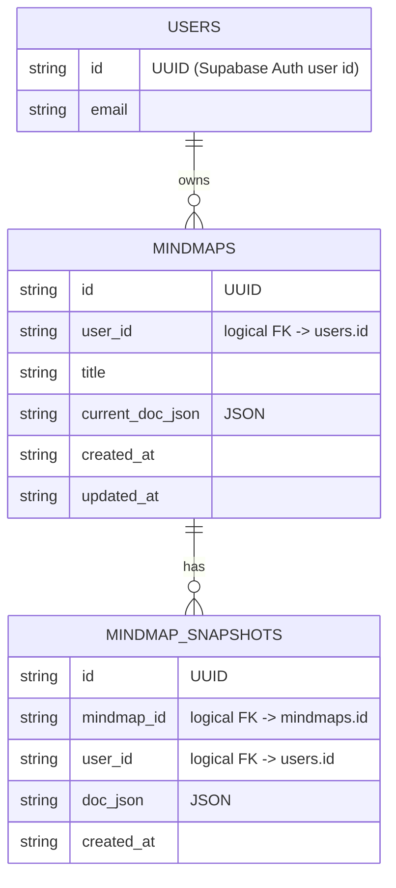

## 1.Architecture design


## 2.Technology Description
- Frontend: React@18 + TypeScript + vite + AntropIA Design System (tokens semânticos)
- Backend: Supabase (Auth + PostgreSQL)
- Infra (deploy em VPS): Docker + Traefik

## 3.Route definitions
| Route | Purpose |
|-------|---------|
| /login | Autenticação do usuário |
| /dashboard | Listagem/criação de mindmaps |
| /mindmap/:id | Editor de mindmap com autosave e export JSON |
| / | Redirecionar para /dashboard (logado) ou /login (deslogado) |

## 6.Data model(if applicable)

### 6.1 Data model definition


### 6.2 Data Definition Language
Mindmaps (mindmaps)
```
CREATE TABLE IF NOT EXISTS mindmaps (
  id UUID PRIMARY KEY DEFAULT gen_random_uuid(),
  user_id UUID NOT NULL,
  title TEXT NOT NULL DEFAULT 'Novo mindmap',
  current_doc_json JSONB NOT NULL DEFAULT '{}'::jsonb,
  created_at TIMESTAMPTZ NOT NULL DEFAULT now(),
  updated_at TIMESTAMPTZ NOT NULL DEFAULT now()
);

CREATE INDEX IF NOT EXISTS idx_mindmaps_user_id_updated_at
  ON mindmaps(user_id, updated_at DESC);

-- permissões (ajuste fino via RLS recomendado)
GRANT ALL PRIVILEGES ON mindmaps TO authenticated;
```

Snapshots (mindmap_snapshots)
```
CREATE TABLE IF NOT EXISTS mindmap_snapshots (
  id UUID PRIMARY KEY DEFAULT gen_random_uuid(),
  mindmap_id UUID NOT NULL,
  user_id UUID NOT NULL,
  doc_json JSONB NOT NULL,
  created_at TIMESTAMPTZ NOT NULL DEFAULT now()
);

CREATE INDEX IF NOT EXISTS idx_snapshots_mindmap_id_created_at
  ON mindmap_snapshots(mindmap_id, created_at DESC);

GRANT ALL PRIVILEGES ON mindmap_snapshots TO authenticated;
```

Init (opcional)
```
--