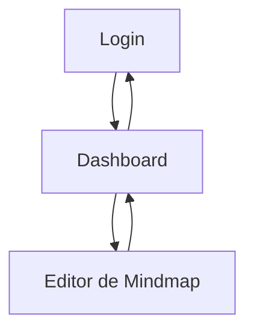

## 1. Product Overview
Um MVP navegável de mindmaps com autenticação, dashboard e editor.
Você cria/edita mindmaps com autosave por snapshots e exporta o conteúdo em JSON.

## 2. Core Features

### 2.1 User Roles
| Papel | Método de cadastro | Permissões principais |
|------|---------------------|----------------------|
| Usuário autenticado | Login (Supabase Auth) | Acessar dashboard; criar/abrir mindmaps; editar e salvar snapshots; exportar JSON |

### 2.2 Feature Module
Nosso MVP consiste nas seguintes páginas principais:
1. **Login**: autenticação, estados de carregamento/erro.
2. **Dashboard**: lista de mindmaps, criar novo, abrir existente.
3. **Editor de Mindmap**: edição do grafo, autosave de snapshots, histórico básico de snapshots, exportar JSON.

### 2.3 Page Details
| Page Name | Module Name | Feature description |
|-----------|-------------|---------------------|
| Login | Formulário de acesso | Autenticar com email/senha; validar campos; exibir erro; redirecionar após login. |
| Login | Sessão | Detectar sessão existente e redirecionar para o Dashboard. |
| Dashboard | Lista de mindmaps | Listar mindmaps do usuário; exibir “última atualização”; abrir item. |
| Dashboard | Criar mindmap | Criar um mindmap vazio com título padrão; navegar para o Editor. |
| Dashboard | Sair | Encerrar sessão e voltar ao Login. |
| Editor de Mindmap | Canvas de edição | Criar/selecionar/mover nós; editar texto do nó; criar/remover conexões; pan/zoom. |
| Editor de Mindmap | Autosave (snapshots) | Salvar snapshots automaticamente (debounce); indicar status (salvando/salvo/erro); retomar após refresh. |
| Editor de Mindmap | Histórico de snapshots | Listar snapshots recentes; restaurar um snapshot selecionado (com confirmação). |
| Editor de Mindmap | Exportação JSON | Exportar mindmap atual em arquivo `.json` (download local). |
| Editor de Mindmap | Navegação | Voltar ao Dashboard; exibir título do mindmap; alertar sobre erro de salvamento. |

## 3. Core Process
**Fluxo do Usuário**
1. Você acessa a página de Login e autentica com email/senha.
2. No Dashboard, você visualiza seus mindmaps e cria um novo ou abre um existente.
3. No Editor, você edita o mindmap; o sistema salva snapshots automaticamente.
4. Você pode restaurar um snapshot anterior e exportar o mindmap atual em JSON.
5. Você volta ao Dashboard ou faz logout.

